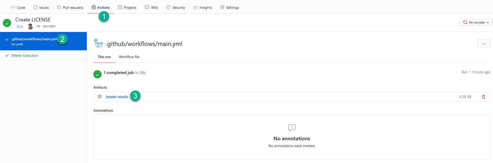

# About PerfAction

[](https://dev.to/qainsights/perfaction-run-jmeter-performance-tests-191)
[](https://saythanks.io/to/catch.nkn%40gmail.com)
[](https://qainsights.com)
[](https://qainsights.com)
[](https://www.youtube.com/user/QAInsights?sub_confirmation=1)

This GitHub Action helps to automate performance testing using [Apache JMeter](https://jmeter.apache.org/) and its [plugins](https://jmeter-plugins.org/). 

PerfAction also featured in LoadTestWorld 2021 conference.


# How to use this GitHub Action?

## Prerequisites
Following are the prerequisites for this GitHub Action:

* `test-plan-path`
  * Mandatory
  * JMeter test plan and its dependencies such as test data, plugins etc
* `args`
  * Optional
  * Additional arguments you can pass it to your test plan execution

## Usage

### Example #1 with no arguments

```
- name: JMeter Test
  uses: QAInsights/PerfAction@v3.1
  with:
    test-plan-path: ./TestPlans/S01_SimpleExample/S01_SimpleExample.jmx
    args: ""
- name: Upload Results
  uses: actions/upload-artifact@v2
  with:
    name: jmeter-results
    path: result.jtl
```

### Example #2 with arguments

```
- name: JMeter Test
  uses: QAInsights/PerfAction@v3.1
  with:
    test-plan-path: ./TestPlans/S01_SimpleExample/S01_SimpleExample.jmx
    args: "-H my.proxy.server -P 8000"
    
- name: Upload Results
  uses: actions/upload-artifact@v2
  with:
    name: jmeter-results
    path: result.jtl
```

## Download JMeter Test Results

By default, this GitHub Action will log the performance statistics under `result.jtl`. After the execution, it will be uploaded to the GitHub artifacts.

To download the JMeter results, go to your `Actions` and then click on the executed workflow, then click on `jmeter-results` link which will download the zip file.


